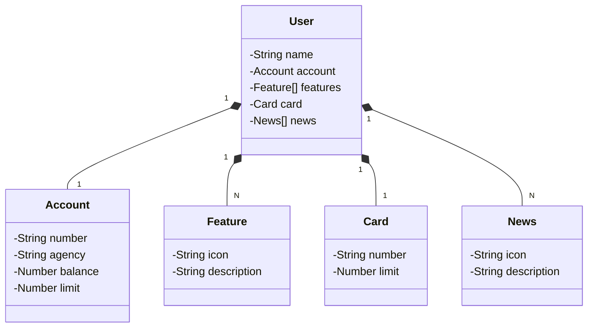

# Desafio de Projeto DIO - API RESTful

## Tecnologias usadas

- **java 17**
- **Springboot 3**
- **Java JPA**
- **Swagger API**

## Diagrama de Classes

 

- [Repository DIO](https://github.com/digitalinnovationone/santander-dev-week-2023-api)

